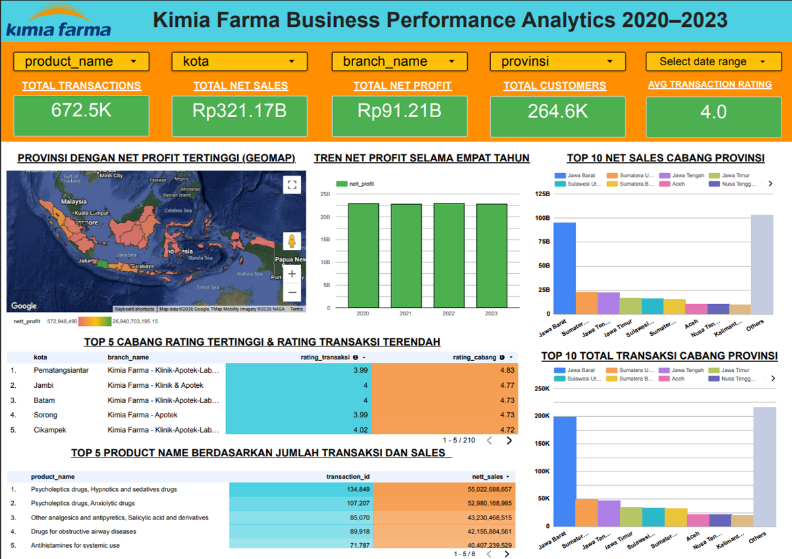

# Kimia Farma Big Data Analytics — Performance Analysis 2020–2023

Final project for the **Rakamin Academy x Kimia Farma Big Data Analytics** 
Project-Based Virtual Internship Program.

---

## Background of KIMIA FARMA

Kimia Farma is Indonesia's first and largest pharmaceutical company, founded 
in 1817 under the Dutch colonial era as *NV Chemicalien Handel Rathkamp & Co.* 
It was nationalized in 1958 and later became *PT Kimia Farma (Persero)* in 
1971. Since February 2026, it operates as *Perusahaan Perseroan (Persero) 
PT Kimia Farma Tbk*, a subsidiary of PT Bio Farma under Indonesia's state-owned 
Pharmaceutical Holding.

Today, Kimia Farma runs an integrated healthcare business spanning 
manufacturing, R&D, distribution, and retail — with over 1,300 pharmacy 
outlets and 400 clinics/laboratories nationwide, making it the market leader 
in Indonesian pharmaceutical retail.

As a Big Data Analytics Intern on this program, the task was to evaluate 
Kimia Farma's business performance from **2020 to 2023**, using real 
transactional-scale data across the company's branch network.

## Problem Statement

- Which provinces and branches drive the most revenue and profit?
- Where do customer satisfaction gaps exist between branch reputation and 
  actual transaction experience?
- How has Kimia Farma's performance trended year-over-year from 2020–2023?
- Which products contribute most to transaction volume and sales?

## Tools Used

| Tool | Purpose |
|---|---|
| **Google BigQuery** | Data warehousing, SQL transformation & analysis |
| **Google Looker Studio** | Interactive dashboard visualization |
| **GitHub** | Version control and project documentation |

## Datasets Used

Four datasets were provided and imported into BigQuery as-is (table names 
matching filenames, minus `.csv`):

| Dataset | Rows | Description |
|---|---|---|
| `kf_final_transaction` | 672,458 | Transaction-level sales records (transaction_id, date, branch_id, product_id, price, discount, rating) |
| `kf_product` | 150 | Product catalog (product_id, product_name, product_category, price) |
| `kf_kantor_cabang` | 1,725 | Branch master data (branch_id, branch_category, branch_name, kota, provinsi, rating) |
| `kf_inventory` | 1,035,000 | Stock levels per branch/product (inventory_id, branch_id, product_id, opname_stock) |

---

## Step-by-Step Methodology

### Phase 0 — Environment Setup
1. Created GCP project `Rakamin_KF_Analytics`
2. Created BigQuery dataset `kimia_farma` inside that project
3. Initialized this GitHub repository to document SQL syntax and findings
4. Confirmed Looker Studio access under the same Google account

### Phase 1 — Importing Datasets to BigQuery
1. Imported all four CSVs into the `kimia_farma` dataset using BigQuery's 
   native schema auto-detection
2. Validated the `date` column specifically, since raw values (e.g. `9/7/2023`) 
   are ambiguous between M/D and D/M formats:

```sql
-- Check for null/failed date parsing
SELECT COUNT(*) AS null_dates
FROM `kimia_farma.kf_final_transaction`
WHERE date IS NULL;

-- Check date range and total row count
SELECT MIN(date) AS min_date, MAX(date) AS max_date, COUNT(*) AS total_rows
FROM `kimia_farma.kf_final_transaction`;

-- Check monthly distribution for parsing anomalies
SELECT EXTRACT(MONTH FROM date) AS month, COUNT(*) AS n
FROM `kimia_farma.kf_final_transaction`
GROUP BY month
ORDER BY month;
```

**Result:** 0 null dates, full range confirmed `2020-01-01` to `2023-12-30` 
across all 672,458 rows, with an even monthly distribution — confirming 
BigQuery correctly auto-detected the `M/D/YYYY` format.

### Phase 2 — Building the Analysis Table

**Data Model (Star Schema):**

`kf_final_transaction` serves as the **fact table** (grain: one row per 
transaction), joined to two **dimension tables**:

| Table | Primary Key | Foreign Keys |
|---|---|---|
| `kf_final_transaction` | `transaction_id` | `product_id`, `branch_id` |
| `kf_product` | `product_id` | — |
| `kf_kantor_cabang` | `branch_id` | — |

**Relationships:**
- `kf_product` → `kf_final_transaction`: One-to-Many
- `kf_kantor_cabang` → `kf_final_transaction`: One-to-Many
- `kf_product` → `kf_inventory`: One-to-Many
- `kf_kantor_cabang` → `kf_inventory`: One-to-Many

`kf_inventory` shares the same two foreign keys but operates at a different 
grain (stock snapshot per branch/product), so it was **not** joined into 
the transaction-grain analysis table — doing so would cause row fan-out 
and inflate every downstream metric.

Because both relationships into the fact table are many-to-one, an 
`INNER JOIN` is safe and preserves all rows with no duplication.

Full query: [`sql/01_analysis_table.sql`](sql/01_analysis_table.sql)

```sql
CREATE OR REPLACE TABLE `kimia_farma.kf_analysis_table` AS

WITH transaction_base AS (
  SELECT
    transaction_id,
    date,
    branch_id,
    customer_name,
    product_id,
    price                AS actual_price,
    discount_percentage,
    rating                AS rating_transaksi
  FROM `kimia_farma.kf_final_transaction`
),

joined AS (
  SELECT
    t.transaction_id, t.date, t.branch_id,
    b.branch_name, b.kota, b.provinsi,
    b.rating              AS rating_cabang,
    t.customer_name, t.product_id, p.product_name,
    t.actual_price, t.discount_percentage, t.rating_transaksi
  FROM transaction_base t
  INNER JOIN `kimia_farma.kf_kantor_cabang` b ON t.branch_id = b.branch_id
  INNER JOIN `kimia_farma.kf_product` p ON t.product_id = p.product_id
)

SELECT
  transaction_id, date, branch_id, branch_name, kota, provinsi,
  rating_cabang, customer_name, product_id, product_name,
  actual_price, discount_percentage,

  CASE
    WHEN actual_price <= 50000 THEN 0.10
    WHEN actual_price <= 100000 THEN 0.15
    WHEN actual_price <= 300000 THEN 0.20
    WHEN actual_price <= 500000 THEN 0.25
    ELSE 0.30
  END AS persentase_gross_laba,

  ROUND(actual_price * (1 - discount_percentage), 2) AS nett_sales,

  ROUND(actual_price * (1 - discount_percentage) *
    CASE
      WHEN actual_price <= 50000 THEN 0.10
      WHEN actual_price <= 100000 THEN 0.15
      WHEN actual_price <= 300000 THEN 0.20
      WHEN actual_price <= 500000 THEN 0.25
      ELSE 0.30
    END, 2) AS nett_profit,

  rating_transaksi
FROM joined;
```

**Validation:** [`sql/02_validation_queries.sql`](sql/02_validation_queries.sql)

```sql
SELECT
  COUNT(DISTINCT branch_id)   AS unique_branch_ids,
  COUNT(DISTINCT branch_name) AS unique_branch_names,
  COUNT(DISTINCT kota)        AS unique_kota
FROM `kimia_farma.kf_analysis_table`;
```

**Key finding:** `branch_name` returned only **3 distinct values** (it 
functions as a category label — e.g. "Kimia Farma - Apotek" — not a unique 
identifier), while `branch_id` returned **1,725 distinct values**. All 
branch-level analysis in this project therefore groups by `branch_id`, 
not `branch_name`.

### Phase 3 — Dashboard (Google Looker Studio)

`kf_analysis_table` was connected as the sole data source, powering a 
two-page interactive dashboard:

**Main Dashboard:**
- Title, 5 filter controls (product, kota, branch, provinsi, date range)
- 5 summary scorecards (transactions, nett sales, nett profit, customers, avg rating)
- Indonesia geo map — net profit by provinsi
- Year-over-year net profit trend (2020–2023)
- Top 10 provinces by nett sales
- Top 10 provinces by total transactions
- Top 5 branches: highest branch rating vs. lowest transaction rating
- Bonus: Top 5 products by transaction volume and sales


🔗 **[View Live Dashboard]https://datastudio.google.com/reporting/69487df2-270c-4ab2-99eb-594592428a9f**




---

## Key Findings & Recommendations

**1. Geographic concentration in Java**
Net profit is heavily concentrated in Java-based provinces, with Jawa Barat 
leading by roughly 4x the next-highest province.
→ *Recommendation:* Investigate whether underperforming provinces face 
branch-coverage gaps or pricing/assortment mismatches.

**2. Stable but plateaued YoY growth**
Net profit held steady (~20–22B) across all four years with no major 
swings — notably even through the pandemic period.
→ *Recommendation:* Explore growth opportunities in underserved provinces 
rather than relying on organic growth in saturated markets.

**3. Hidden performers outside the top provinces**
The aggregated "Others" category (all remaining provinces) rivals Jawa 
Barat's individual total, suggesting meaningful revenue exists outside 
the headline performers.
→ *Recommendation:* Drill down into individual provinces within "Others" 
to identify untapped high-performers.

**4. Rating-mismatch branches**
Five branches (Pematangsiantar, Jambi, Batam, Sorong, Cikampek) show high 
branch ratings (4.7–4.83) but noticeably lower transaction ratings 
(3.99–4.02) — a ~0.7–0.8 point gap.
→ *Recommendation:* Prioritize a customer-service/checkout-process audit 
at these specific branches, since the issue appears transaction-level, 
not location-level.

**5. Product concentration risk**
Psycholeptic drugs (sedatives and anxiolytics) dominate both transaction 
volume and sales, well ahead of other categories.
→ *Recommendation:* Ensure consistent inventory availability for these 
high-demand categories to avoid stockout-driven revenue and satisfaction loss.

---

## Author Information

**Jovi Jethrovian Tampi**  
BSc (Hons) Global Supply Chain Management, Sunway University Malaysia  
📧 jovitampi01@gmail.com  
🔗 [LinkedIn](https://linkedin.com/in/jovi-tampi)
